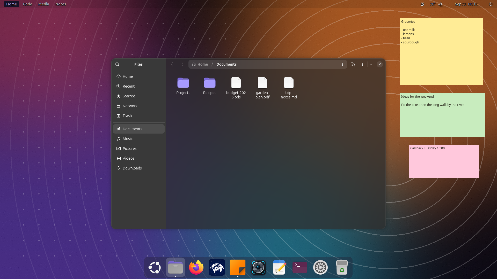
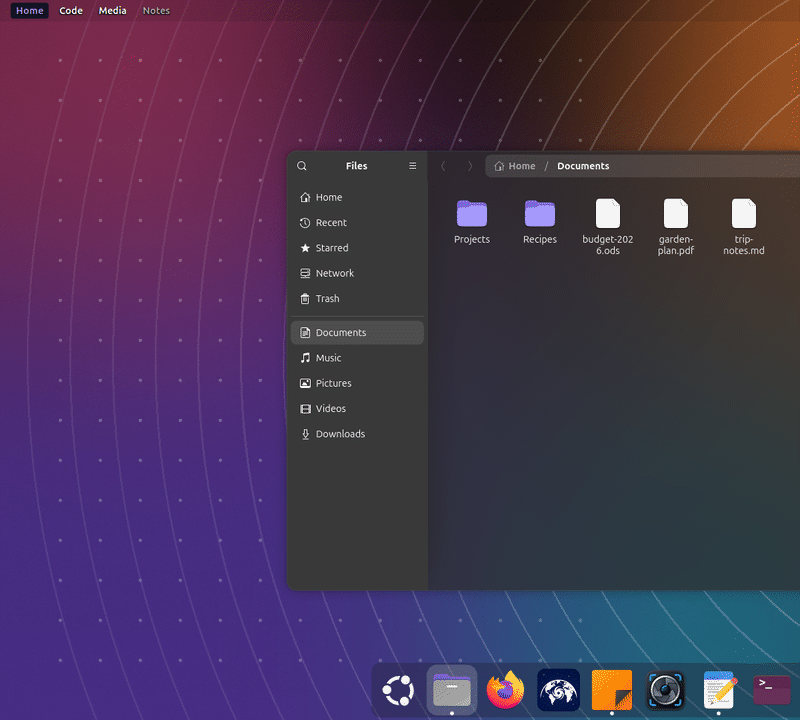
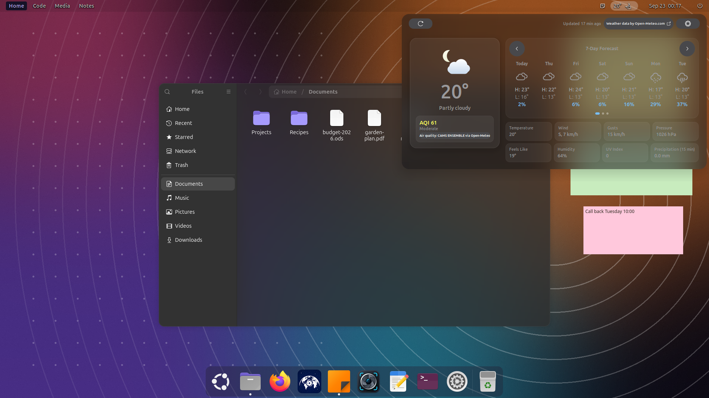
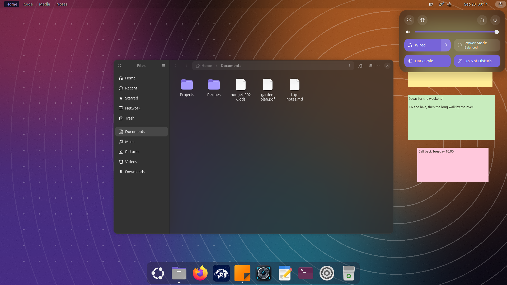
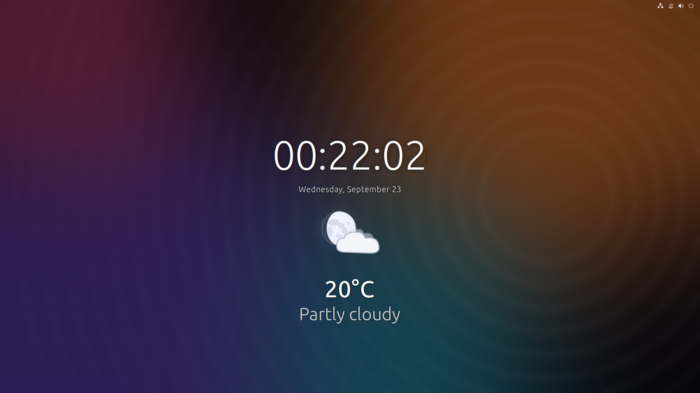

<h1 align="center">NorviOS</h1>

<p align="center">
  <strong>The NorviTech look for Ubuntu 26.04, from the boot splash to the window glass.</strong><br>
  A reversible layer over stock Ubuntu and GNOME 50, applied only through the override points Ubuntu provides, so updates keep working and one command puts the original back.
</p>

<p align="center">
  <a href="https://norvitech.com"></a>
  <a href="https://github.com/spencercnorton/norvi-os/actions/workflows/ci.yml"></a>
  <a href="https://github.com/spencercnorton/norvi-os/tags"></a>
  <a href="#install"></a>
  <a href="LICENSE"></a>
  <a href="https://buy.stripe.com/8x26oH2U44f65TRe574wM04"></a>
</p>

<p align="center">
  
</p>

Every screenshot here was captured on a fresh Ubuntu 26.04 virtual machine with a demo account, a generated wallpaper and invented notes; nothing personal.

NorviOS is the desktop the NorviTech apps are built on: stock Ubuntu 26.04 LTS
with GNOME 50 on Wayland, rebranded from the first boot frame and restyled so
GTK windows read as frosted glass. It is not a separate distribution. This
repository is a layer you install on an existing Ubuntu desktop, and remove
again, with one command for each half.

## What it does

**Brands the boot.** A Plymouth theme — the NorviTech mark on black, above
Ubuntu's own spinner — is registered with `update-alternatives` at a higher
priority than Ubuntu's, and built into the initramfs of every installed
kernel. No Ubuntu file is edited.

**Brands the login screen and Settings → About.** The login screen logo goes
through Debian's greeter-customisation conffile, and the edit is validated
with `dconf compile` before it can reach the live greeter. The About logo, in
a light and a dark variant, replaces Ubuntu's two logo files through local
`dpkg` diversions, with Ubuntu's copies kept beside them.

<p align="center">
  
  
</p>

<p align="center">
  <picture>
    <source media="(prefers-color-scheme: dark)" srcset="docs/screenshots/about-dark.png">
    
  </picture>
</p>

**Turns GTK windows to glass.** A per-user GTK3 and GTK4 stylesheet stops
each window painting its background at full opacity, and
[Blur my Shell](https://extensions.gnome.org/extension/3193/blur-my-shell/)
blurs the desktop behind it. Header bars and page backgrounds go glass, a
window's sidebar turns solid while the window has focus, and text, lists and
canvases stay opaque. The installer refuses any transparency that would take
primary text below WCAG AA contrast.

**Undoes exactly what it did.** `uninstall.sh` restores Ubuntu's boot splash,
login screen and logo files. The desktop installer records what it changes
before changing it — a stylesheet you already had, your Blur my Shell
settings, the blacklist entries it adds — and `--uninstall` puts back exactly
that, and nothing that was yours.

### The desktop around it

The screenshots show the whole NorviOS desktop, not just what this repository
installs. The rest is a set of GNOME Shell extensions, most of them
NorviTech's own and several of them forks, which are **not published yet**:
each needs its own licence and code review first. Until then this is what they
are, so nothing on this page is a mystery.

| On screen | Extension | Origin |
|---|---|---|
| The dock, centred at the bottom, blurred, and the app launcher that opens from it, with drawers you create from a right-click | XDock | NorviTech fork of [Dash to Dock](https://github.com/micheleg/dash-to-dock) |
| The blur behind the dock, menus and windows, with rounded corners | Blur my Shell (Norvi build) and gnome-rounded-blur | Fork of [Blur my Shell](https://github.com/aunetx/blur-my-shell); the rounded-blur library is in the APT repository |
| Named workspaces on the left of the top bar | Space Bar | Fork of [Space Bar](https://github.com/christopher-l/space-bar) |
| The top bar that turns transparent over the desktop | Transparent Top Bar | Fork of [Transparent Top Bar](https://github.com/lamarios/gnome-shell-extension-transparent-top-bar) |
| The weather in the top bar and its forecast panel | GEweather | NorviTech fork of [SimpleWeather](https://github.com/romanlefler/SimpleWeather) |
| The clock on the right of the top bar | Move Clock | [Third-party](https://extensions.gnome.org/extension/2/move-clock/), unchanged |
| A system menu that shows only the power button | Power-only Quick Settings | NorviTech |
| The large clock and weather on the lock screen | Lock Screen Suite | NorviTech |
| Per-monitor wallpapers and rotation | Wallpaper Suite | NorviTech |
| Sticky notes that come back where you left them | [XNote](https://github.com/spencercnorton/xnote) and [XNote Placement](https://github.com/spencercnorton/xnote-placement) | NorviTech, published |

<p align="center">
  
</p>

<p align="center">
  
</p>

<p align="center">
  
</p>

<p align="center">
  
  
</p>

<p align="center">
  
</p>

**Sits under the NorviTech desktop apps**, each of which is its own
repository:

| App | What it is |
|---|---|
| [Helios](https://github.com/spencercnorton/helios) | A native desktop for coding agents: Claude Code, OpenAI Codex and OpenRouter |
| [XNote](https://github.com/spencercnorton/xnote) | Sticky notes that stay on your desktop |
| [XNote Placement](https://github.com/spencercnorton/xnote-placement) | A GNOME Shell extension that puts each XNote note back where you left it |
| [SnipSnap](https://github.com/spencercnorton/snipsnap) | Screenshot any region of any monitor on GNOME Wayland |


## Install

### Ubuntu 26.04 — from source

```bash
git clone https://github.com/spencercnorton/norvi-os.git
cd norvi-os
sudo ./install.sh              # boot splash, login screen and About logo, from the next boot
./desktop/install-desktop.sh   # window glass for your user; no sudo
```

`install.sh` takes about a minute, most of it rebuilding the initramfs.
Nothing restarts; the boot splash and the login screen change from the next
boot, and Settings shows the new logo the next time it opens.

The glass needs [Blur my Shell](https://extensions.gnome.org/extension/3193/blur-my-shell/)
installed and enabled first; Ubuntu does not package it. Without it the
desktop installer stops and says so, rather than leaving translucent windows
over a sharp wallpaper. `./desktop/install-desktop.sh --stylesheet-only`
installs the stylesheet on its own if that is what you want.

To remove everything:

```bash
sudo ./uninstall.sh
./desktop/install-desktop.sh --uninstall
```

There is no package yet. NorviOS is not in
[the APT repository](https://github.com/spencercnorton/helios#install) that
serves the NorviTech apps, and it has only been tested on Ubuntu 26.04 LTS
with GNOME 50 on Wayland.

## Documentation

- [How it works](docs/how-it-works.md) — the override point behind each
  surface, why each one survives an Ubuntu update, and the measurements behind
  the glass
- [NOTICE](NOTICE) — what the GPL covers, and the separate terms for the
  NorviTech artwork
- [CHANGELOG.md](CHANGELOG.md) — one entry per release

## Where your data lives

| Path | Purpose |
|---|---|
| `/usr/share/plymouth/themes/norvitech/` | The boot splash theme, registered with `update-alternatives` |
| `/etc/gdm3/greeter.dconf-defaults` | One `logo=` line pointing the login screen at the NorviTech mark |
| `/usr/share/pixmaps/ubuntu-logo-text.svg` and `ubuntu-logo-text-dark.svg` | Replaced through local `dpkg` diversions; Ubuntu's files are kept beside them as `*.stock-norvi` |
| `/usr/local/share/norvitech/` | The logo files and an install timestamp |
| `/boot/initrd.img-*` | Rebuilt so that the splash is inside the initramfs |
| `~/.config/gtk-3.0/gtk.css` and `~/.config/gtk-4.0/gtk.css` | The glass stylesheet; one you already had is kept as `gtk.css.pre-norvi` and restored on uninstall |
| Blur my Shell's settings | Application blur on at full window opacity, for every window except the desktop icons and two Chromium browsers |
| `~/.local/state/norvi-os/` | What the desktop installer changed, so that `--uninstall` undoes exactly that |

Nothing leaves the machine: neither installer uses the network.

## Contributing and support

- Bugs and feature requests: [open an issue](https://github.com/spencercnorton/norvi-os/issues/new/choose). Questions: [Discussions](https://github.com/spencercnorton/norvi-os/discussions).
- Security reports: [private vulnerability reporting](https://github.com/spencercnorton/norvi-os/security/advisories/new) — see [SECURITY.md](SECURITY.md). There is no e-mail address; that is deliberate.
- Pull requests are welcome; read [CONTRIBUTING.md](CONTRIBUTING.md) first — this repository is a release mirror, and accepted changes ship in the next tagged release.
- If NorviOS saves you time, you can [support its development](https://buy.stripe.com/8x26oH2U44f65TRe574wM04).

## Development

```bash
python3 desktop/check_contrast.py              # what CI runs: the glass keeps text above WCAG AA
bash desktop/test-blacklist-merge.sh
bash desktop/test-uninstall-restore.sh
shellcheck -S warning install.sh uninstall.sh desktop/*.sh
```

The installers change boot and login configuration, so they are run on a
clean Ubuntu 26.04 virtual machine before a release rather than in CI. The
screenshots above come from that machine.

## Licence

[GPL-3.0-or-later](LICENSE) © Spencer Norton

The NorviTech artwork — the logo files under `assets/` and `gdm/`, and
`plymouth/watermark.png` — is not under the GPL. [NOTICE](NOTICE) sets its
terms, which do not allow modifying it or using it to brand another product.

---

<p align="center">
  <a href="https://norvitech.com"></a>
</p>

<p align="center">
  <a href="https://github.com/spencercnorton/helios">Helios</a> ·
  <a href="https://github.com/spencercnorton/bitagent">BitAgent</a> ·
  <a href="https://github.com/spencercnorton/xnote">XNote</a> ·
  <a href="https://github.com/spencercnorton/xnote-placement">XNote Placement</a> ·
  <a href="https://github.com/spencercnorton/snipsnap">SnipSnap</a> ·
  <a href="https://github.com/spencercnorton/conductor">Conductor</a> ·
  <a href="https://github.com/spencercnorton/swiss-ui">Swiss UI</a> ·
  <a href="https://github.com/spencercnorton/norvi-os">NorviOS</a> ·
  <a href="https://norvitech.com">norvitech.com</a>
</p>
