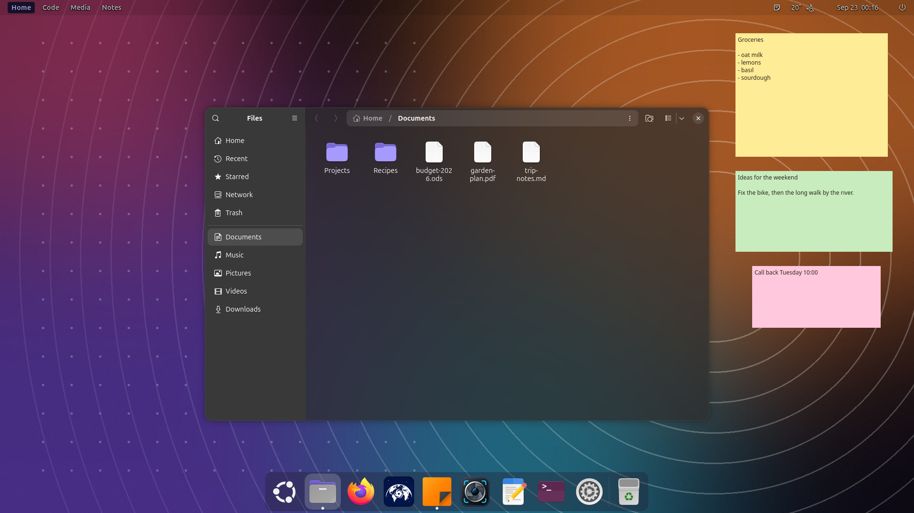

# NorviOS deployment and operations

NorviOS is a reversible branding and glass-style layer for Ubuntu, rather
than a separate distribution. The screenshots show a wider desktop suite;
this repository does not install every extension pictured.

## Supported environment

The supported baseline is Ubuntu 26.04 LTS, GNOME 50 and a Wayland desktop.
Have a working backup, a normal user account, sudo access and enough free
space in `/boot` for initramfs regeneration. Test organizational desktop
policies in a virtual machine before rolling them out to workstations.

```bash
cat /etc/os-release
gnome-shell --version
df -h /boot
```

## Install and configure

```bash
git clone https://github.com/spencercnorton/norvi-os.git
cd norvi-os
# For reproducibility, check out a reviewed version tag before installation.
sudo ./install.sh
./desktop/install-desktop.sh
```

The first command installs Plymouth, the greeter logo and About-panel logos.
It updates boot files and needs sudo. The desktop command changes only your
user's GTK styles and blur settings; run it without sudo.

Install and enable a compatible Blur my Shell first. Without it the desktop
installer refuses to make windows translucent. `--stylesheet-only` is an
explicit alternative when you manage blur separately.



## Verify each surface

1. Read the installers' final checks and keep the output privately.
2. Reopen Settings → About and inspect both light and dark appearance.
3. Open Files and a text editor; confirm labels are legible over your wallpaper.
4. On the next planned reboot, check the splash and login logo.
5. Verify launcher, workspace and weather extensions separately if you installed
   them. Those components have their own compatibility and configuration.


## Configuration and ownership

| Surface | Configuration owner |
|---|---|
| Boot splash | Plymouth alternative and generated initramfs |
| Greeter logo | Debian's greeter customization conffile |
| About logos | Local package diversions, preserving original files |
| GTK glass | Per-user GTK3 and GTK4 stylesheets |
| Background blur | The user's Blur my Shell settings |
| Reversal record | `~/.local/state/norvi-os/` |

Keep the reversal record and the saved pre-install stylesheets. They tell the
uninstaller what was yours before installation. Do not delete them as cache.
The installers themselves do not access the network.

## Rollback and upgrades

```bash
sudo ./uninstall.sh
./desktop/install-desktop.sh --uninstall
```

These restore the original branding and the user's recorded desktop settings.
Check About, GTK styles and the next boot again after rollback. Before a major
Ubuntu or GNOME upgrade, verify compatibility in a fresh VM. Do not assume an
extension for one Shell major version works on another.

## Troubleshooting

| Symptom | Check and next action |
|---|---|
| Installer refuses the desktop | Check Ubuntu/GNOME versions and Blur my Shell availability. |
| Background is translucent but sharp | Confirm blur is enabled; inspect extension compatibility. |
| Boot branding looks unchanged | Check installer output and reboot into the regenerated kernel image. |
| User stylesheet already existed | Preserve the pre-install copy; use the uninstall path to restore it. |
| Empty folder looks opaque | Some GTK status pages remain opaque; this is a known styling boundary. |

Use a demo account for public reports. Remove usernames, wallpaper metadata,
window titles and real notes from screenshots. See [how it works](how-it-works.md)
for the exact override points and contrast checks.
